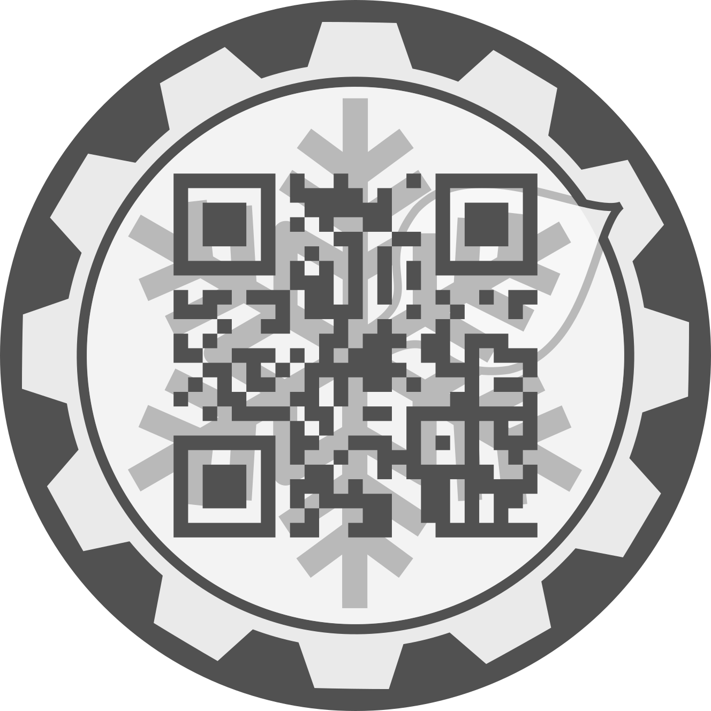

# Norlab QR Code Generator

This Python module allows you to generate QR codes with a Norlab snowflake background.

## Dependencies

This project uses the following Python packages:
- svgutils 
- segno

## Usage 

To generate a QR code, you can use the `norlab_qr` command from your system console. You can pass a URL as an argument to `--url`. If no URL is passed, the default "https://norlab.ulaval.ca" will be used.

For example:
```bash
python3 norlab_qr.py --url http://example.com
```

This command will generate two .svg files (`qr_dark.svg` and `qr_light.svg`) within your current directory with a QR code centered on a Norlab snowflake image.

- qr_dark.svg: QR code on a dark background.
- qr_light.svg: QR code on a light background.


